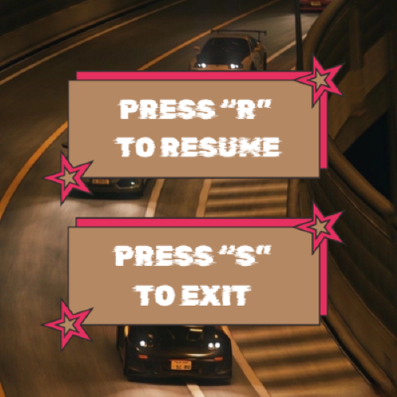

## RACING CAR

## Giới thiệu
Racing Car là trò chơi bạn cần né các vật cản để vượt qua 9 vòng chơi, mỗi vòng sẽ tăng tốc độ của vật cản.

## Cách chơi
Bạn dùng các phím <- và -> để né các vật cản.

## Một vài Screenshot

)
.jpg
)

)

)
